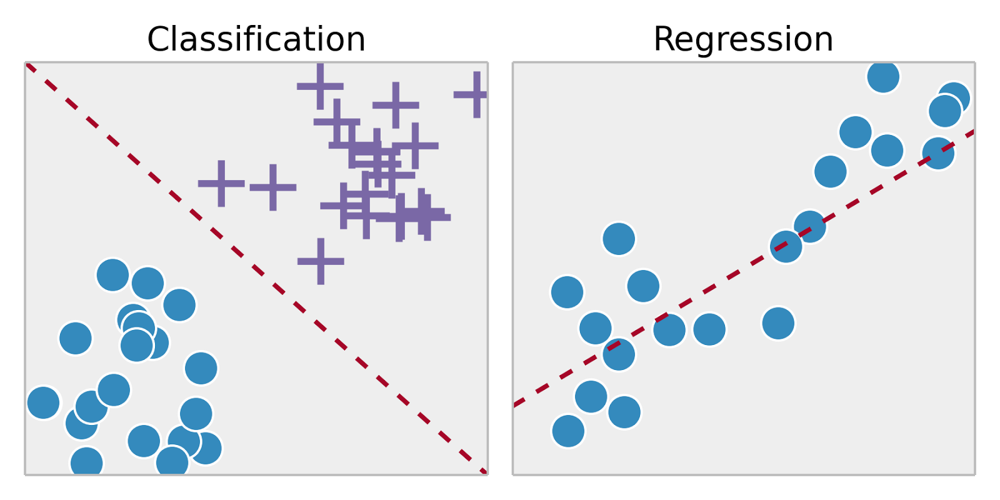

# Machine-Learning-Study-Groups

# What is Machine Learning?

   - A branch of artificial intelligence, concerned with the design and development of algorithms that allow computers to evolve behaviors based on empirical data.

   - As intelligence requires knowledge, it is necessary for the computers to acquire knowledge.

 # Machine Learning Applications ?
 - ### Spam filtering 
 - ### Credit card fraud detection 
 - ### Digit recognition on checks, zip codes 
 - ### Detecting faces in images 
 - ### Recommendation system 
 - ### Search engines 
 - ### Handwriting recognition 
 - ### etc...

# What is learning type?

## Supervised
   - In supervised learning, we have access to examples of correct input-output pairs that we can show to the machine during the training phase. The common example of handwriting recognition is typically approached as a supervised learning task. We show the computer a number of images of handwritten digits along with the correct labels for those digits, and the computer learns the patterns that relate images to their labels.

## Unsupervised
   - In unsupervised learning, we have access to examples of correct input only that we can show to the machine during the training phase. The common example of handwriting recognition is typically approached as a unsupervised learning task. We show the computer a number of images of handwritten digits along without labels, and the computer learns the patterns that relate images for each of them.

# What is Supervised learning problems?

## What is Classification problem ?
   - Classification problems ask the algorithm to predict a discrete value, identifying the input data as the member of a particular class, or group. In a training dataset of animal images, that would mean each photo was pre-labeled as cat or koala. The algorithm is then evaluated by how accurately it can correctly classify new images of other koalas and cats.

## What is Regression problem ?

   - regression problems look at continuous data. One use case, linear regression, should sound familiar from algebra class: given a particular x value, what’s the expected value of the y variable?

# What is Unsupervised learning problems?

## What is Clustering problem ?
  -  Without being an expert ornithologist, it’s possible to look at a collection of bird photos and separate them roughly by species, relying on cues like feather color, size or beak shape. That’s how the most common application for unsupervised learning, clustering, works: the deep learning model looks for training data that are similar to each other and groups them together.
    

# Tools for start ?
   - ### [Python 3.6.7](https://www.python.org/downloads/release/python-367/)
   - ### [Anaconda](https://www.anaconda.com/download/)

# Machine learning steps ?
 - ### Retreat Review
 - ### Data Collection
  - ### [Google Dataset Search](https://toolbox.google.com/datasetsearch)
  - ### [Kaggle](https://www.kaggle.com/)
  - ### etc ...
 - ### Data Preprocessing
 - ### machine learning model
 - ### Performance/Accuracy
